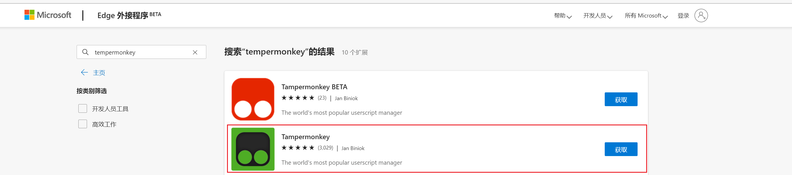
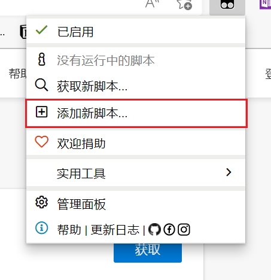
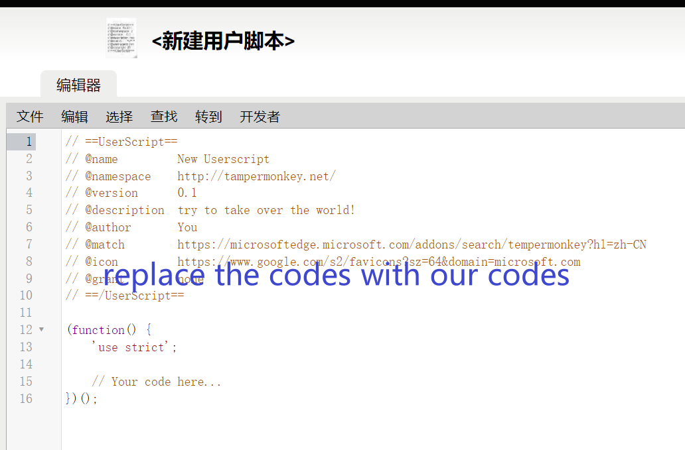

# 清华博士生实践选课页面增强插件


### 功能：

你是否觉得当前清华博士生实践的选课网站[http://thshijian.tsinghua.edu.cn](http://thshijian.tsinghua.edu.cn)的部分设计不太好用？比如点击```申请```之后会在当前页面打开标签页，覆盖已有的状态。

我也这么觉得，所以写个脚本调整一下。


使用本插件后，点击```申请```后会开启新的标签页，不会影响之前的状态，可以方便地在多个页面之间浏览。

### 使用

1. 在应用商店里搜索并安装tampermonkey扩展（油猴脚本）。

    这里使用edge为例，chrome,360等同理
    

2. 单击tampermonkey插件，选择添加新脚本，将[```thushijian_plugin.js```](thushijian_plugin.js)中的内容复制到代码页面，保存即可。

    

    